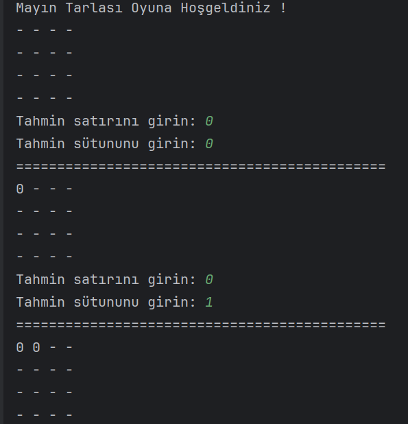
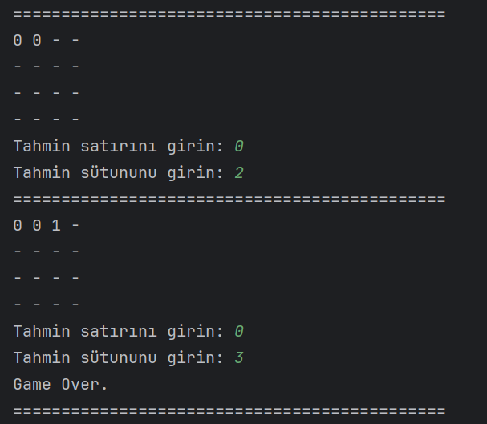
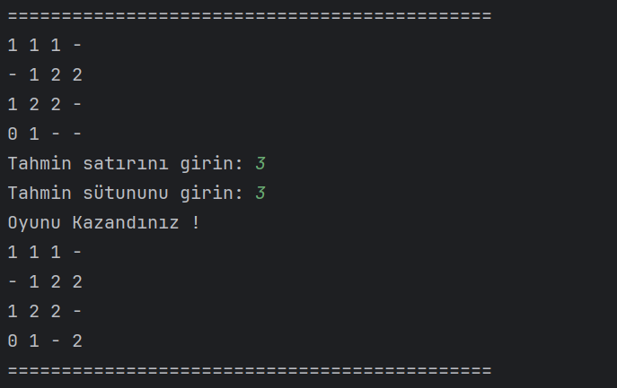
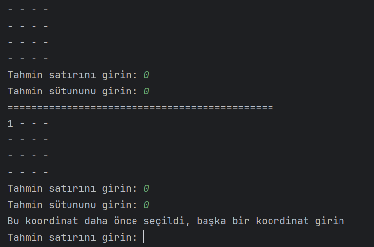
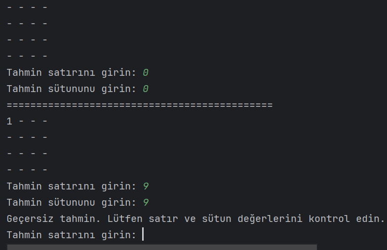

# **MineSweeper**

Bu Java programı, Mayın Tarlası oyununu simüle eder. Oyuncu, belirli bir boyutta bir Mayın Tarlası üzerinde gezinir ve hücrelerin altında saklanan mayınları bulmaya çalışır. Oyun, tüm mayınlar açıldığında veya oyuncu bir mayına basıp oyunu kaybettiğinde sona erer.

## Önemli Notlar :
* Mayın Tarlası en az 2x2 boyutunda olmalıdır. Yani, satır ve sütun sayısı en az 2 olmalıdır.
* Mayınlar, dizi boyutunun çeyreği kadar rastgele yerleştirilir. Örneğin, dizi 4x3 boyutunda ise, eleman sayısı 12 olacaktır. Bu durumda mayın sayısı 12 / 4 = 3 adet olmalıdır. Mayın sayısı, eleman sayısının çeyreği kadar olmalıdır.
* Mayın sayısı, eleman sayısının çeyreğinden az veya çok olmamalıdır. Eğer mayın sayısı bu kuralı ihlal ederse, oyunun başlangıç konfigürasyonu geçersizdir.
* Oyun sırasında, her adımda bir hücre seçilir ve o hücredeki duruma göre oyuncuya geri bildirim verilir.
* Oyuncu, mayın olan bir hücreyi seçerse, oyun kaybedilir. Eğer oyuncu tüm mayınları bulursa, oyun kazanılır.

## **Nasıl Oynanır?**

1. Oyun başladığında, kullanıcıya satır ve sütun sayıları istenir. Bu sayılar, Mayın Tarlası'nın boyutunu belirler.
2. Mayınlar rastgele yerleştirilir ve bir harita oluşturulur.
3. Oyuncu, bir hücre seçerek tahmin yapar. Eğer seçilen hücrede bir mayın varsa, oyun kaybedilir. Eğer mayın yoksa, o hücrenin etrafındaki mayın sayısı gösterilir.
4. Eğer oyuncu bir mayına basarsa, oyun kaybedilir ve sona erer.
5. Eğer oyuncu tüm mayınları bulursa, oyun kazanılır ve sona erer.

## Örnek Çıktı :

### Kaybetme Senaryosu :

### Kazanma Senaryosu :

### Daha Önce Girilen Koordinat Senaryosu :

### Dizinin Sınırlarını Aşma Senaryosu :

